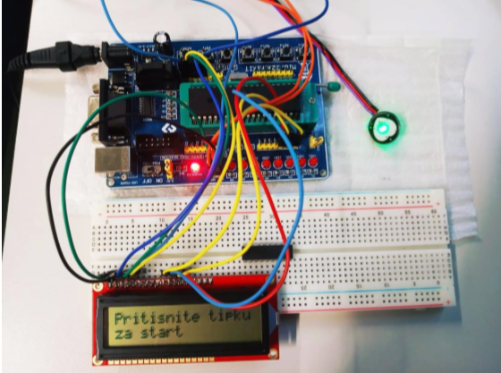

# HeartTest

Puls senzor koji mjeri otkucaje srca 15 sekundi te zatim ispisuju prethodni i trenutno izmjereni prosječni broj otkucaja u minuti (BPM) na 16x2 LCD ekran

### Motivation

Projekt demonstrira potencijalnu primjenu mikrokontrolera, uz odgovarajuće komponente, u stvarnom svijetu. 

## Prerequisites

#### HW
1. Mikrokontroler ATMega16A 
2. PulseSenzor 
3. LCD 16x2 
4. Izvor napajanja

## Getting Started

Nakon ispravnog spajanja hardverskih komponenti i učitavanja main.c file-a uređaj se pokreće pritiskom na KEY4 mikrokontrolera. 
Za što preciznije rezultate potrebno je ispravno pozicionirati senzor na jagodici prsta. 

## About

#### Pritiskom na KEY4: 
➢ Pokreće se mjerenje pulsa; korisnik mora 15 sekundi mirno držati senzor na prstu.  
➢ Kada istekne vrijeme prikazuju se prethodni (zapisani u EEPROM memoriji) i trenutni rezultati mjerenja otkucaja srca
 
#### Pritiskom na KEY3: 
➢ Prikazuju se detaljniji podaci o trenutnom mjerenju
➢ Prikazuje se usporedba trenutnih rezultata s prethodnim

## Built With

* C

## Authors

* **Maja Vrsaljko** - (https://github.com/vrsaljk0)

* **Azra Subašić** - (https://github.com/hax91)

* **Ivana Baćac**  - (https://github.com/Bachvac)

